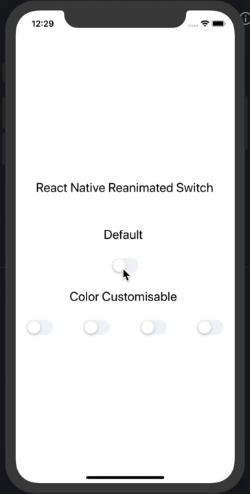

<div align='center'>
  
  
  [](https://www.npmjs.com/package/react-native-reanimated-switch)
  [](https://www.npmjs.com/package/react-native-reanimated-switch)

  <h1>React Native Reanimated Switch</h1>
  
  

</div>

## :anchor: Installation

```sh

yarn add react-native-reanimated-switch
# or
npm i react-native-reanimated-switch

```

## :family: Dependencies

##### React Native Reanimated

```sh
npm install react-native-reanimated
```

For iOS

```sh

cd ios && pod install && cd ..

```

> For detailed instructions check it out [here](https://docs.swmansion.com/react-native-reanimated/docs/next/installation)

> Rebuild the project after adding the dependencies

## :mag: Usage

```js
import React, { useState } from "react";
import { SafeAreaView, StatusBar, StyleSheet, Text, View } from "react-native";
import RNSwitch from "./src/Switch";

const App = () => {
  const [switchState, setSwitchState] = useState(false);
  const handleOnPressSwitch = (value) => {
    setSwitchState(value);
  };
  return (
    <>
      <StatusBar
        barStyle="dark-content"
        translucent={true}
        backgroundColor="white"
      />
      <SafeAreaView style={styles.container}>
        <Text style={styles.header}>React Native Reanimated Switch</Text>
        <Text style={styles.header}>Default </Text>
        <RNSwitch handleOnPress={handleOnPressSwitch} value={switchState} />
        <Text style={styles.header}>Color Customisable </Text>
        <View style={styles.switchContainer}>
          <RNSwitch
            handleOnPress={handleOnPressSwitch}
            activeTrackColor="#FE5F8F"
            value={switchState}
          />
          <RNSwitch
            handleOnPress={handleOnPressSwitch}
            activeTrackColor="#667eea"
            value={switchState}
          />
          <RNSwitch
            handleOnPress={handleOnPressSwitch}
            activeTrackColor="#ed8936"
            value={switchState}
          />
          <RNSwitch
            handleOnPress={handleOnPressSwitch}
            activeTrackColor="#feb2b2"
            value={switchState}
          />
        </View>
      </SafeAreaView>
    </>
  );
};

const styles = StyleSheet.create({
  container: {
    flex: 1,
    display: "flex",
    alignContent: "center",
    justifyContent: "center",
    alignItems: "center",
    backgroundColor: "white",
  },
  header: {
    fontSize: 24,
    paddingVertical: 30,
  },
  switchContainer: {
    display: "flex",
    justifyContent: "space-between",
    flexDirection: "row",
    width: "90%",
  },
});

export default App;
```

## :camera: Screenshot

<div>
  
</div>

## :wrench: Props

| Name               | Description                              | Required | Type     | Default |
| ------------------ | ---------------------------------------- | -------- | -------- | ------- |
| value              | State of switch component                | YES      | Boolean  | -       |
| handleOnPress      | A callback with the current switch state | YES      | Function | -       |
| activeTrackColor   | The track color when switch is active    | NO       | Color    | #007AFF |
| inActiveTrackColor | The track color when switch is inactive  | NO       | Color    | #F2F5F7 |
| thumbColor         | The color of switch thumb                | NO       | Color    | #FFFFFF |

## :tada: Example

Checkout the example [here](https://github.com/timelessco/react-native-reanimated-switch/tree/master/example/RNSearch).

## :notebook: Blog

Will Update Soon.

## :snowman: Built with ❤️ and

- [react-native](https://www.npmjs.com/package/react-native)
- [react-native-reanimated](https://docs.swmansion.com/react-native-reanimated/)

## :v: Contributing

Pull requests are always welcome! Feel free to open a new GitHub issue for any changes that can be made.

## :man: Author

[Karthik B](https://twitter.com/_iam_karthik)

## :clipboard: License

MIT
